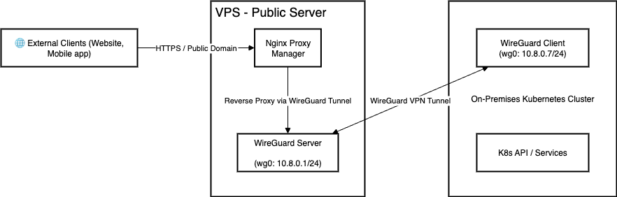

# How to build k8s cluster for development

## Overview


## VPN - Public server

Đầu tiên, chúng ta cần một public server để routing traffic bên ngoài vào k8s cluster.
Ở đây mình dùng VPS của ec2, các bạn có thể thuê bất kì dịch vụ VPS nào khác tuỳ vào nhu cầu và điều kiện kinh tế,
Cấu hình tối thiểu 2 CPU, 1GB RAM là được rồi. 
Sau khi có VPS, ta sẽ tiến hành cài đặt VPN server.

### VPN Setup

[Install WireGuard](https://www.wireguard.com/install/)

```shell
sudo apt update
sudo apt install wireguard -y

# Generate private and public keys for server and clients:
cd /etc/wireguard
wg genkey | tee server_private.key | wg pubkey > server_public.key
wg genkey | tee client_private.key | wg pubkey > client_public.key

cat client_private.key
+Je...Dxm4= # Remember this private key for client config
```

Create file `/etc/wireguard/wg0.conf`
```ini
[Interface]
Address = 10.8.0.1/24
ListenPort = 54211
PrivateKey = \<server_private_key>

PostUp = sysctl -w net.ipv4.ip_forward=1
PostUp = iptables -A FORWARD -i wg0 -j ACCEPT; iptables -t nat -A POSTROUTING -o eth0 -j MASQUERADE
PostDown = iptables -D FORWARD -i wg0 -j ACCEPT; iptables -t nat -D POSTROUTING -o eth0 -j MASQUERADE

[Peer]
PublicKey = <client_public_key>
AllowedIPs = 10.8.0.7/32
```

Replace:
- eth0 → your public network interface
- \<server_private_key> → contents of server_private.key
- \<client_public_key> → contents of client_public.key

Enable and start the WireGuard service:
```shell
sudo systemctl enable wg-quick@wg0
sudo systemctl start wg-quick@wg0
```

Option 1: If you don’t want to route Internet through the VPN
Keep the routing as it is, but tell systemd-resolved to stop using wg0 for DNS:
```shell
# show current DNS server
ip route show table main
sudo resolvectl revert wg0
resolvectl status

```
You should see DNS revert to:

Current DNS Server: 8.8.8.8

✅ DNS resolution will work immediately.

To make it permanent, remove the DNS=1.1.1.1 line in /etc/wireguard/wg0.conf if you’re using wg-quick.

### Nginx Proxy Manager Setup

## On-premise - Local machine

### KubeSphere Installation