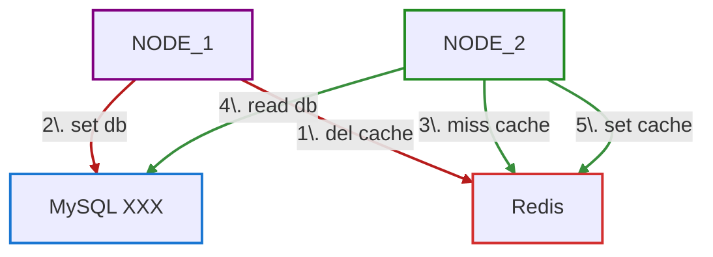

# Redis caching strategy

Bên trong database của hệ thống chứa một danh sách các đồng coin, khi người dùng muốn tìm một đồng coin bất kì, người dùng sẽ gõ vào ô tìm kiếm. Mỗi lần người dùng gõ thêm một ký tự, hệ thống trả về một danh sách gợi ý các đồng coin chứa các ký từ người dùng đã gõ vào.
Hãy thiết kế một chiến lược caching hỗ trợ gợi ý kết quả khi người dùng gõ vào ô tìm kiếm.

 

## Read-through Strategy
Khi có yêu cầu đọc dữ liệu, Redis cache sẽ được kiểm tra trước. Nếu dữ liệu có trong cache (cache hit), dữ liệu sẽ được trả về ngay lập tức. Nếu không, dữ liệu sẽ được đọc từ nguồn dữ liệu chính, sau đó được lưu vào cache trước khi trả về cho ứng dụng.

