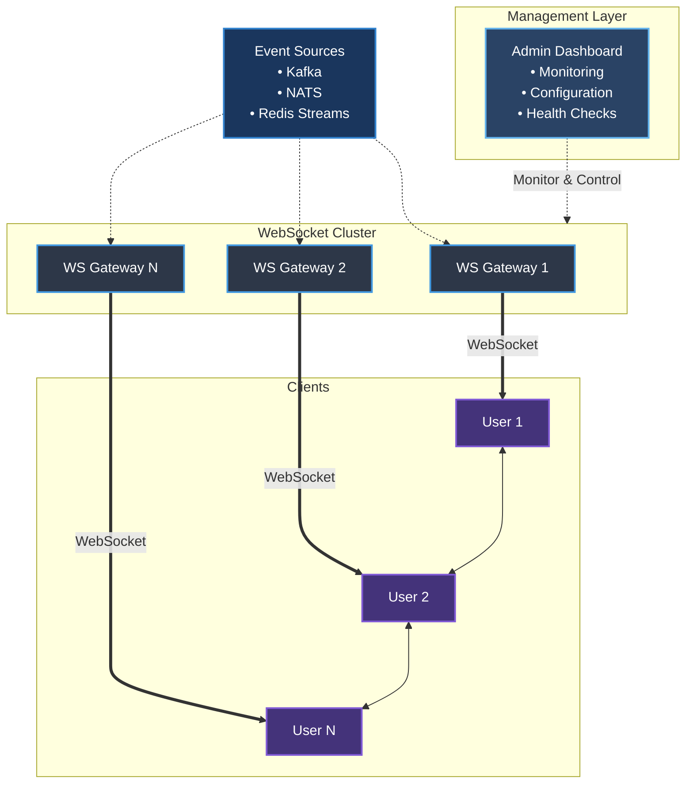

# High Performance Websocket broker

# Table of Contents

- [High Performance Websocket broker](#high-performance-websocket-broker)
  - [1. Core Requirements](#1-core-requirements)
    - [Functional Requirements](#functional-requirements)
    - [Non-Functional Requirements](#non-functional-requirements)
    - [Incoming Event Stream Types](#incoming-event-stream-types)
  - [2. Technology Stack](#2-technology-stack)
  - [3. Implementation Strategy](#3-implementation-strategy)
    - [A. WebSocket Gateway (WS Gateway)](#a-websocket-gateway-ws-gateway)
    - [B. Event Broker](#b-event-broker)
    - [C. Data Channel Format](#c-data-channel-format)
  - [4. Scalability & Resilience](#4-scalability--resilience)
  - [5. Security](#5-security)
  - [6. Observability](#6-observability)
  - [Deliverables in MVP](#deliverables-in-mvp)
  - [7. Acceptance Usecases](#7-acceptance-usecases)
    - [1. Use Case: WebSocket Handshake with Authorization](#1-use-case-websocket-handshake-with-authorization)
      - [Flow](#flow)
      - [Events](#events)
    - [2. Use Case: Subscribe to Allowed Topics](#-2-use-case-subscribe-to-allowed-topics)
      - [Example Topics](#example-topics)
      - [Flow](#flow-1)
      - [Events](#events-1)
    - [3. Use Case: Receive Streamed Data from Kafka and Push to Clients](#-3-use-case-receive-streamed-data-from-kafka-and-push-to-clients)
      - [Flow](#flow-2)
      - [Events](#events-2)
    - [4. Use Case: Unsubscribe from a Topic](#-4-use-case-unsubscribe-from-a-topic)
      - [Actors: Authenticated Client](#actors-authenticated-client)
      - [Description: Clients can unsubscribe from specific topics to save bandwidth.](#description-clients-can-unsubscribe-from-specific-topics-to-save-bandwidth)
      - [Flow](#flow-3)
    - [5. Use Case: Backpressure & Dropping Slow Clients](#-5-use-case-backpressure--dropping-slow-clients)
    - [6. Use Case: Private Stream for Authenticated User](#-6-use-case-private-stream-for-authenticated-user)
      - [Flow](#flow-4)
    - [7. Use Case: Reconnect with Resume Support](#-7-use-case-reconnect-with-resume-support)
      - [Flow](#flow-5)
  - [Summary Table](#-summary-table)

**High-performance WebSocket service for streaming events to end users in a Centralized Exchange (CEX)** system, robust, scalable, and low-latency architecture.

**1.Core Requirements**
--------------------------

### Functional Requirements

*   Dynamic Integration with external event streams (e.g., Kafka, NATS, Redis Stream, etc.)
    
*   Routing Logic per event stream (e.g., queue-to-WebSocket channel binding)
    
*   Mapping/Transformation Layer per stream (e.g., raw -> client-specific format, aggregation, filtering)
    
*   Fault tolerance: if a server fails, clients can reconnect to another available server in the cluster, ensuring uninterrupted service.
    

### Non-Functional Requirements

*   Massive Concurrency Support: 100K+ concurrent WebSocket connections

* Low Latency: \< 100ms end-to-end event delivery
    
*   Horizontal scalability
    
*   Multi-region support (optional)
    
### Incoming Event Stream Types

*   Real-time trade events (trade stream)
    
*   Order book updates (depth stream)
    
*   Price ticker updates (ticker)
    
*   User-specific streams (authenticated via token)

**2.Technology Stack**
--------------------------
| Layer            | Tech Choice                                                      |
|------------------|------------------------------------------------------------------|
| Language         | **Rust** |
| WebSocket Server | [tokio](https://tokio.rs), [rust-libp2p](https://libp2p.io), [axum](https://docs.rs/axum/) |
| Broker/Queue     | **NATS**, **Kafka**, or **Redis Streams**                        |
| Authentication   | JWT / OAuth2 (Token-based over initial handshake) / API-KEY                |
| Orchestration    | Kubernetes (with auto-scaling)                                   |
| Observability    | Prometheus + Grafana + Loki/ELK                                  |

**3. Implementation Strategy**
---------------------------------

### **A. WebSocket Gateway (WS Gateway)**

*   Written in **Go** or **uWebSockets.js** for high concurrency.
    
*   Handle subscribe/unsubscribe messages.
    
*   Authenticate with JWT.
    
*   Maintain channel to client list mapping.
    
*   Push data from broker to clients using in-memory pub/sub.
    

### **B. Event Broker**

*   Matching engine publishes events to Kafka/NATS per topic: trades.btc_usdt, depth.eth_usdt, ticker.global.
    
*   Use partitions (in Kafka) or topics (in NATS) for high fanout performance.
    

### **C. Data Channel Format**

`{ "stream": "depth.btc_usdt", "data": { "asks": [["36200.5", "1.2"]], "bids": [["36190.1", "1.1"]], "timestamp": 1724548345123 } }`

**4. Scalability & Resilience**
----------------------------------

| Concern | Solution |
|---------|----------|
| Scaling WS | Stateless WS servers with sticky sessions or centralized pub/sub |
| Resilience | Retry on publish failure, circuit breakers |
| Backpressure | Drop slow clients, use bounded queues |
| Horizontal Scale | Deploy WS Gateway with Kubernetes HPA + custom autoscaler on CPU & connection count |

**5. Security**
------------------

*   WebSocket authentication during handshake:
    
    *   Clients provide JWT.
        
    *   JWT is validated by Auth service.
        
*   Message signing for sensitive topics (like orders).
    
*   WAF or Layer-7 firewall (AWS WAF, Cloudflare, etc).
    

**6. Observability**
-----------------------

Track:

*   Number of active connections
    
*   Events per second
    
*   Latency (matching engine → user)
    
*   Dropped events, client disconnects
    

Use:

*   Prometheus metrics in Go
    
*   Logs to Loki or ELK stack
    
*   Grafana dashboards
    

**Deliverables in MVP**
--------------------------

*   WebSocket Gateway with topic subscriptions
    
*   Kafka/NATS integration
    
*   Sample clients (web + CLI)
    
*   Dashboard for live metrics
    
*   Test with 10K-100K concurrent simulated clients using Artillery or k6
    

7. Acceptance Usecases
-----------------------

### **1. Use Case: WebSocket Handshake with Authorization**

Actors: Web Client / Mobile Client, WebSocket Gateway, Auth Service

Description: Clients initiate WebSocket connection with a JWT or API key.

### **Flow:**

1.  Client connects to /ws endpoint.
    
2.  During the upgrade request, the client includes a JWT in headers or query param.
    
3.  WebSocket Gateway validates the JWT with the Auth Service.
    
4.  On success:
    
    *   User info (userId, roles, allowed pairs) is extracted and cached.
        
    *   Connection is accepted.
        
5.  On failure: return HTTP 401 and reject upgrade.
    

### **Events:**

*   onConnectionOpen()
    
*   onAuthValidate(token)
    
*   onConnectionAccepted() / onConnectionRejected()
    

### 2. Use Case: Subscribe to Allowed Topics

Actors: Authenticated Client, WebSocket Gateway

Description: After successful handshake, client sends a subscription request.

### **Example Topics:**

*   ticker.btc_usdt
    
*   depth.btc_usdt
    
*   orders.user123 (private)
    

### **Flow:**

1.  Client sends:
    

`{ "action": "subscribe", "streams": ["ticker.btc_usdt", "orders.user123"] }`

2.  WebSocket Gateway:
    
3.  Validates topic access (e.g., user can only subscribe to orders.user123)
    
4.  Registers client to internal channel (e.g., Redis pub/sub or in-memory topic map)
    

### **Events:**

*   onSubscribeRequest(streams)
    
*   onTopicPermissionCheck()
    
*   onSubscriptionConfirmed()
    

### **3. Use Case: Receive Streamed Data from Kafka and Push to Clients**

Actors: Kafka, WebSocket Gateway

Description: Internal services (e.g., Matching Engine) publish messages to Kafka. The Gateway consumes and routes them to subscribed clients.

### **Flow:**

1.  Matching Engine publishes message:
    

`{ "stream": "ticker.btc_usdt", "data": { "price": "36200.5", "volume": "1.25", "timestamp": 1724548381123 } }`

2.  Kafka consumer inside WebSocket Gateway receives the message.
    
3.  Gateway looks up clients subscribed to ticker.btc_usdt.
    
4.  Message is broadcasted to all connected WebSocket clients of that topic.
    

### **Events:**

*   onKafkaMessage(topic, message)
    
*   onMessageDispatch(topic → clients[])
    

### **4. Use Case: Unsubscribe from a Topic**

### **Actors: Authenticated Client**

### **Description: Clients can unsubscribe from specific topics to save bandwidth.**

### **Flow:**

1.  Client sends:
    

`{ "action": "unsubscribe", "streams": ["ticker.btc_usdt"] }`

2.  Gateway removes client from internal routing list for that topic.
    

### **5. Use Case: Backpressure & Dropping Slow Clients**

Actors: WebSocket Gateway

Description: If client cannot consume messages fast enough, drop it to avoid memory leaks.

Flow:

1.  Gateway maintains a message queue per client (e.g., ring buffer or channel).
    
2.  If queue exceeds threshold or client write times out:
    
    *   Send disconnect with reason
        
    *   Close WebSocket
        

### **6. Use Case: Private Stream for Authenticated User**

Actors: Authenticated Client, Order Service

Description: Users receive their order updates through orders.user123 stream.

### **Flow:**

1.  Order Service publishes private order update to Kafka topic: orders.user123
    
2.  WebSocket Gateway reads this Kafka topic
    
3.  Routes message only to the client authenticated as user123
    

### **7. Use Case: Reconnect with Resume Support**

Actors: Authenticated Client, WebSocket Gateway

Description: If connection is lost, allow client to reconnect and resume from last known sequence.

### **Flow:**

1.  Client reconnects and sends:
    
`{ "action": "resume", "streams": ["depth.btc_usdt"], "lastSequence": 21253412 }`

2.  Gateway queries cache or buffer (e.g., Redis or local memory) for missed messages.
    
3.  Sends missed updates, then resumes real-time stream.
    

**Summary Table**
---------------------
| Use Case           | Description                          | Key Events            |
|--------------------|--------------------------------------|------------------------|
| Handshake + Auth   | JWT-based connection init            | onAuthValidate         |
| Subscribe Topics   | Subscribe to market/private topics   | onSubscribeRequest     |
| Kafka to Clients   | Consume Kafka & push to clients      | onKafkaMessage         |
| Unsubscribe        | Stop receiving a stream              | onUnsubscribeRequest   |
| Backpressure       | Drop or pause slow clients           | onClientOverload       |
| Private Streams    | Per-user updates                     | onUserStreamPush       |
| Resume Support     | Reconnect and resume                 | onResumeStream         |

