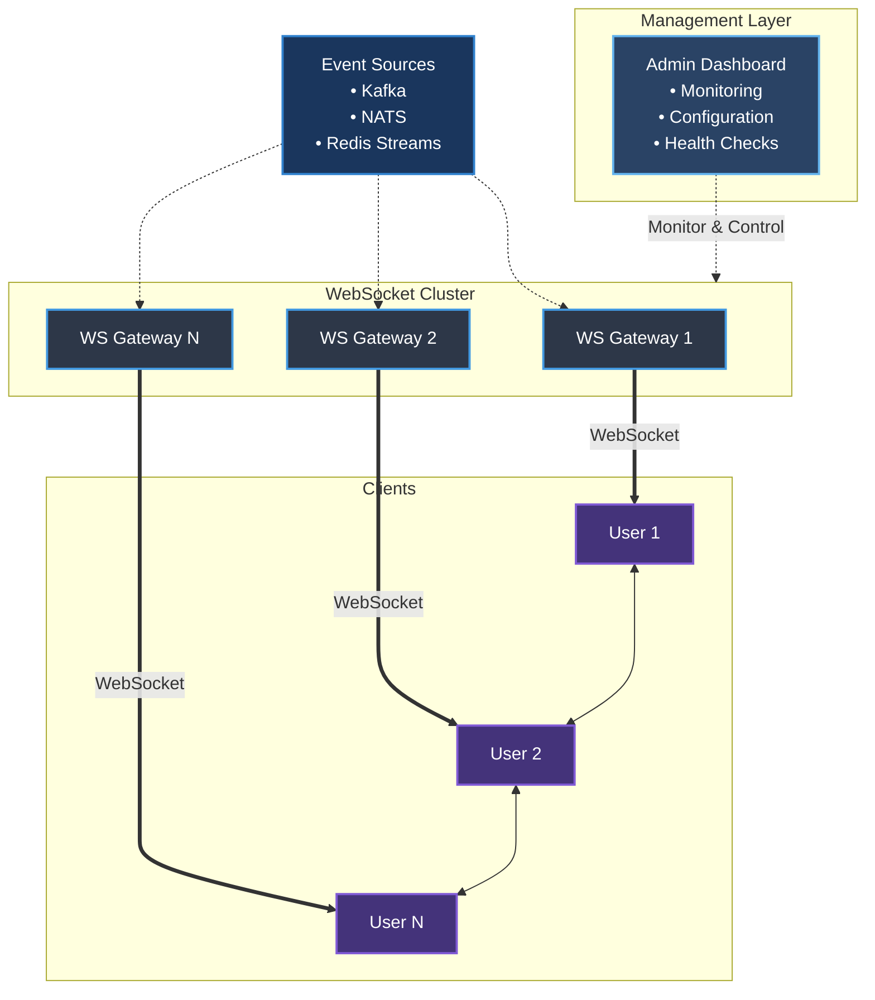

# High Performance WebSocket Broker

:::info Overview
High-performance WebSocket service for streaming events to end users in a **Centralized Exchange (CEX)** system — robust, scalable, and low-latency architecture.
:::



---

## 1. Core Requirements

### Functional Requirements

- Dynamic integration with external event streams (e.g., Kafka, NATS, Redis Stream)
- Routing logic per event stream (e.g., queue-to-WebSocket channel binding)
- Mapping/transformation layer per stream (e.g., raw → client-specific format, aggregation, filtering)
- Fault tolerance: if a server fails, clients can reconnect to another available server in the cluster

### Non-Functional Requirements

- **Massive Concurrency**: 100K+ concurrent WebSocket connections
- **Low Latency**: < 100ms end-to-end event delivery
- **Horizontal Scalability**
- **Multi-region support** (optional)

### Incoming Event Stream Types

- Real-time trade events (trade stream)
- Order book updates (depth stream)
- Price ticker updates (ticker)
- User-specific streams (authenticated via token)

---

## 2. Technology Stack

| Layer | Tech Choice |
|-------|-------------|
| Language | **Rust** |
| WebSocket Server | [tokio](https://tokio.rs), [rust-libp2p](https://libp2p.io), [axum](https://docs.rs/axum/) |
| Broker/Queue | **NATS**, **Kafka**, or **Redis Streams** |
| Authentication | JWT / OAuth2 (token-based over initial handshake) / API-KEY |
| Orchestration | Kubernetes (with auto-scaling) |
| Observability | Prometheus + Grafana + Loki/ELK |

---

## 3. Implementation Strategy

### A. WebSocket Gateway

- Written in **Go** or **uWebSockets.js** for high concurrency
- Handle subscribe/unsubscribe messages
- Authenticate with JWT
- Maintain channel-to-client-list mapping
- Push data from broker to clients using in-memory pub/sub

### B. Event Broker

- Matching engine publishes events to Kafka/NATS per topic: `trades.btc_usdt`, `depth.eth_usdt`, `ticker.global`
- Use partitions (Kafka) or topics (NATS) for high fanout performance

### C. Data Channel Format

```json
{
  "stream": "depth.btc_usdt",
  "data": {
    "asks": [["36200.5", "1.2"]],
    "bids": [["36190.1", "1.1"]],
    "timestamp": 1724548345123
  }
}
```

---

## 4. Scalability & Resilience

| Concern | Solution |
|---------|----------|
| Scaling WS | Stateless WS servers with sticky sessions or centralized pub/sub |
| Resilience | Retry on publish failure, circuit breakers |
| Backpressure | Drop slow clients, use bounded queues |
| Horizontal Scale | Deploy WS Gateway with Kubernetes HPA + custom autoscaler on CPU & connection count |

---

## 5. Security

- WebSocket authentication during handshake:
- Clients provide JWT
- JWT is validated by Auth service
- Message signing for sensitive topics (like orders)
- WAF or Layer-7 firewall (AWS WAF, Cloudflare, etc.)

---

## 6. Observability

**Track:**
- Number of active connections
- Events per second
- Latency (matching engine → user)
- Dropped events, client disconnects

**Use:**
- Prometheus metrics in Go
- Logs to Loki or ELK stack
- Grafana dashboards

---

## MVP Deliverables

- WebSocket Gateway with topic subscriptions
- Kafka/NATS integration
- Sample clients (web + CLI)
- Dashboard for live metrics
- Test with 10K–100K concurrent simulated clients using Artillery or k6

---

## 7. Acceptance Use Cases

### Use Case 1: WebSocket Handshake with Authorization

**Actors:** Web Client / Mobile Client, WebSocket Gateway, Auth Service

**Description:** Clients initiate WebSocket connection with a JWT or API key.

<details>
    <summary><strong>Flow</strong></summary>

    1. Client connects to `/ws` endpoint
    2. During the upgrade request, the client includes a JWT in headers or query param
    3. WebSocket Gateway validates the JWT with the Auth Service
    4. On success:
    - User info (`userId`, `roles`, `allowedPairs`) is extracted and cached
    - Connection is accepted
    5. On failure: return HTTP 401 and reject upgrade

    **Events:** `onConnectionOpen()` → `onAuthValidate(token)` → `onConnectionAccepted()` / `onConnectionRejected()`

</details>

---

### Use Case 2: Subscribe to Allowed Topics

**Actors:** Authenticated Client, WebSocket Gateway

**Description:** After successful handshake, client sends a subscription request.

<details>
    <summary><strong>Flow</strong></summary>

    **Example Topics:** `ticker.btc_usdt`, `depth.btc_usdt`, `orders.user123` (private)

    1. Client sends:
    ```json
    {"action": "subscribe", "streams": ["ticker.btc_usdt", "orders.user123"]}
    ```
    2. WebSocket Gateway validates topic access (e.g., user can only subscribe to `orders.user123`)
    3. Registers client to internal channel (e.g., Redis pub/sub or in-memory topic map)

    **Events:** `onSubscribeRequest(streams)` → `onTopicPermissionCheck()` → `onSubscriptionConfirmed()`

</details>

---

### Use Case 3: Receive Streamed Data from Kafka

**Actors:** Kafka, WebSocket Gateway

**Description:** Internal services (e.g., Matching Engine) publish messages to Kafka. The Gateway consumes and routes them to subscribed clients.

<details>
    <summary><strong>Flow</strong></summary>

    1. Matching Engine publishes message:
    ```json
    {
        "stream": "ticker.btc_usdt",
        "data": {"price": "36200.5", "volume": "1.25", "timestamp": 1724548381123}
    }
    ```
    2. Kafka consumer inside WebSocket Gateway receives the message
    3. Gateway looks up clients subscribed to `ticker.btc_usdt`
    4. Message is broadcasted to all connected WebSocket clients of that topic

    **Events:** `onKafkaMessage(topic, message)` → `onMessageDispatch(topic → clients[])`

</details>

---

### Use Case 4: Unsubscribe from a Topic

**Actors:** Authenticated Client

**Description:** Clients can unsubscribe from specific topics to save bandwidth.

<details>
    <summary><strong>Flow</strong></summary>

    1. Client sends:
    ```json
    {"action": "unsubscribe", "streams": ["ticker.btc_usdt"]}
    ```
    2. Gateway removes client from internal routing list for that topic

</details>

---

### Use Case 5: Backpressure & Dropping Slow Clients

**Actors:** WebSocket Gateway

**Description:** If client cannot consume messages fast enough, drop it to avoid memory leaks.

<details>
    <summary><strong>Flow</strong></summary>

    1. Gateway maintains a message queue per client (e.g., ring buffer or channel)
    2. If queue exceeds threshold or client write times out:
    - Send disconnect with reason
    - Close WebSocket

</details>

---

### Use Case 6: Private Stream for Authenticated User

**Actors:** Authenticated Client, Order Service

**Description:** Users receive their order updates through `orders.user123` stream.

<details>
    <summary><strong>Flow</strong></summary>

    1. Order Service publishes private order update to Kafka topic: `orders.user123`
    2. WebSocket Gateway reads this Kafka topic
    3. Routes message only to the client authenticated as `user123`

</details>

---

### Use Case 7: Reconnect with Resume Support

**Actors:** Authenticated Client, WebSocket Gateway

**Description:** If connection is lost, allow client to reconnect and resume from last known sequence.

<details>
    <summary><strong>Flow</strong></summary>

    1. Client reconnects and sends:
    ```json
    {"action": "resume", "streams": ["depth.btc_usdt"], "lastSequence": 21253412}
    ```
    2. Gateway queries cache or buffer (e.g., Redis or local memory) for missed messages
    3. Sends missed updates, then resumes real-time stream

</details>

---

## Summary Table

| Use Case | Description | Key Events |
|----------|-------------|------------|
| Handshake + Auth | JWT-based connection init | `onAuthValidate` |
| Subscribe Topics | Subscribe to market/private topics | `onSubscribeRequest` |
| Kafka to Clients | Consume Kafka & push to clients | `onKafkaMessage` |
| Unsubscribe | Stop receiving a stream | `onUnsubscribeRequest` |
| Backpressure | Drop or pause slow clients | `onClientOverload` |
| Private Streams | Per-user updates | `onUserStreamPush` |
| Resume Support | Reconnect and resume | `onResumeStream` |