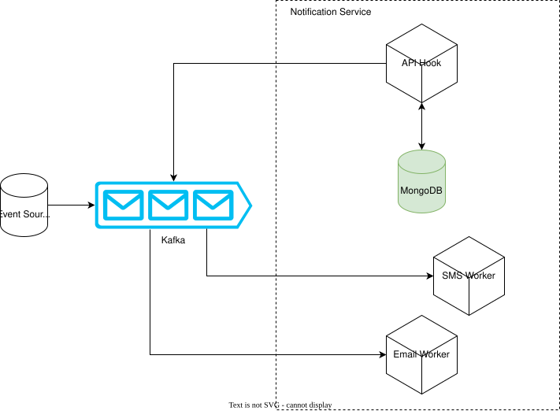

# Notification Service

Design record for a multi-channel notification service — the component that takes an event
from somewhere in the system and turns it into something a user actually receives, without
losing it and without sending it twice.

:::info[Diagram-first record]
The substance of this design lives in the diagrams below. They existed as
`.drawio` and image files with no document referencing them, so nothing on the site could
render them and nothing linked to them. This page is that missing document.
:::

## Architecture overview

The shape to notice: event producers never talk to a delivery channel directly. Everything
funnels through a broker, so a channel being down becomes a queue that drains later rather
than an event that vanished.

## Design sources

These are the working artifacts. The `.drawio` files are editable in
[diagrams.net](https://app.diagrams.net); open them there rather than trying to read the XML.

| Artifact | What it holds |
|---|---|
| [Entity-relationship model](/files/notify_service_ERD.drawio) | Tables and their relationships — templates, channels, recipients, delivery attempts |
| [Sequence diagram](/files/notify_service_seq.drawio) | The path of one notification from event to delivery receipt |
| [Use-case diagram](/files/notify_service_usecase.drawio) | Actors and what each is allowed to trigger |
| [Kafka cluster sizing calculator](/files/kafka-cluster-sizing-calculator.xlsx) | The partition/throughput model behind the broker sizing |

## Where the hard parts are

A notification service looks like a CRUD app and behaves like a distributed system. The
failure modes worth reading before extending this design:

- **[Message delivery semantics](/docs/production-patterns/message-delivery-semantics)** —
  exactly-once delivery does not exist; you get at-least-once and make the *effect* happen once.
- **[Webhook provider design](/docs/production-patterns/webhook-provider-design)** — if this
  service ever calls out to a customer endpoint, sending once is not delivering.
- **[Timeouts and retries](/docs/production-patterns/timeouts-and-retries)** — retry without
  idempotency is not error handling.

## Status

Draft. The diagrams are settled; the written design is not. The Kafka sizing model has not
been re-checked against current volumes.
