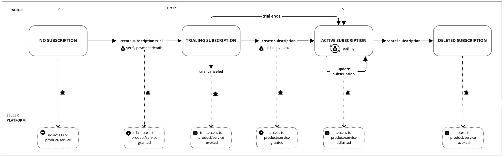
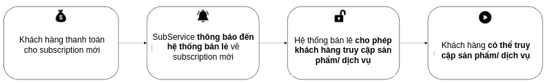
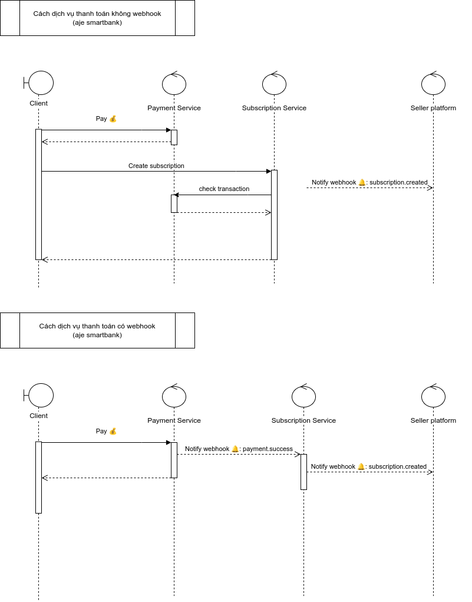
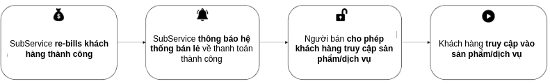
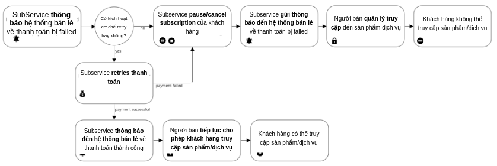
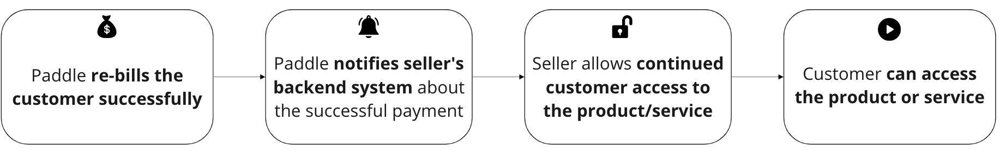
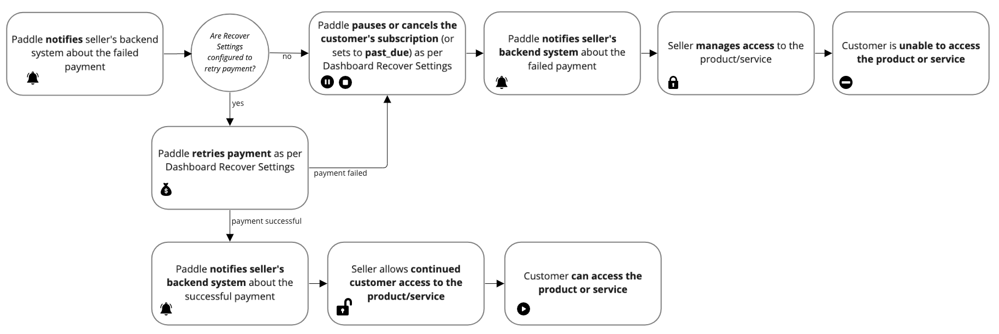

# Subscription Service

Design record for recurring billing — creating a subscription, taking the first payment,
then rebilling on a cycle and handling the cases where that payment fails.

:::info[Diagram-first record]
This design existed as an 11,000-word Word document and seven exported flow diagrams that
no page referenced, so none of it was readable on the site or findable by search. This page
is that missing document. The `.docx` remains the long-form source and is linked below.
:::

## What a subscription is here

## Creating a subscription

The sequence, in detail:

## The first payment

Success and failure are genuinely different flows, not one flow with a branch — the failure
path has to decide whether the subscription exists at all.

## Rebilling

The recurring charge, and what happens when it fails mid-cycle:

## Design sources

| Artifact | What it holds |
|---|---|
| [Full design document](/files/subscription-service-design.docx) | The long-form design — ~11,000 words, the authoritative source |
| [Webhook design](/files/subscription-webhook-design.drawio) | Provider callback handling |
| [Task breakdown](/files/subscription-tasks.drawio) | Implementation decomposition |

## Where the hard parts are

Recurring billing is where payment failure modes concentrate. Read these before changing
any state transition:

- **[Payment state and idempotency](/docs/production-patterns/payment-state-and-idempotency)** —
  a payment is a state machine with an idempotency key, never a boolean.
- **[Payment provider and webhooks](/docs/production-patterns/payment-provider-and-webhooks)** —
  a provider response and a webhook are external signals, not truth.
- **[Order and payment consistency](/docs/production-patterns/payment-order-consistency)** —
  money moved and the subscription updated are two facts in two places, and no transaction
  spans both.
- **[Refunds](/docs/production-patterns/payment-refunds)** — a refund is a new transaction,
  not an undo. Mid-cycle cancellation is a refund question.
- **[Temporal data](/docs/production-patterns/temporal-data)** — a price or plan that changes
  over time means the billing decision must be defensible after the fact.

## Status

Draft. Diagrams are settled. The written design still lives in the `.docx`; this page is a
navigable index over it, not a replacement.
