# WebSocket Gateway Cluster SDD

## 1. Document Control

| Field | Value |
|-------|-------|
| **Document Version** | 1.0 |
| **Date** | August 18, 2025 |
| **Author(s)** | TikTuzki |
| **Reviewed by** | — |
| **Approved by** | — |
| **Status** | Draft |

---

## 2. Introduction

### 2.1 Purpose

High-performance WebSocket service for streaming events to end users in a Centralized Exchange (CEX) system — robust, scalable, and low-latency architecture.

### 2.2 Scope

This SDD covers the architecture, design, and implementation of a high-performance WebSocket service for streaming real-time events to end users in a CEX system.

**In Scope:**

- Integration with external event sources (Kafka, NATS, Redis Streams) to deliver event streams (Depth, Realtime, Kline, BBO) to clients via WebSocket
- Support for massive concurrency (100K+ connections), low-latency delivery (\<100ms), horizontal scalability, and optional multi-region deployment
- Authentication (API-KEY/ListenKey), routing logic, transformation/mapping layers, fault tolerance, and observability
- Management layer (admin dashboard), deployment strategies (Kubernetes), and integration with external systems
- Detailed use cases: handshake/auth, topic subscription/unsubscription, trade actions, event streaming, backpressure handling, private streams, and resume support

### 2.3 References

- HashKey WebSocket [API Documentation](https://hashkeyglobal-apidoc.readme.io/reference/ws-v2-trade)
- Binance WebSocket [API Documentation](https://developers.binance.com/docs/derivatives/usds-margined-futures/websocket-market-streams)

---

## 3. System Overview

### 3.1 System Context

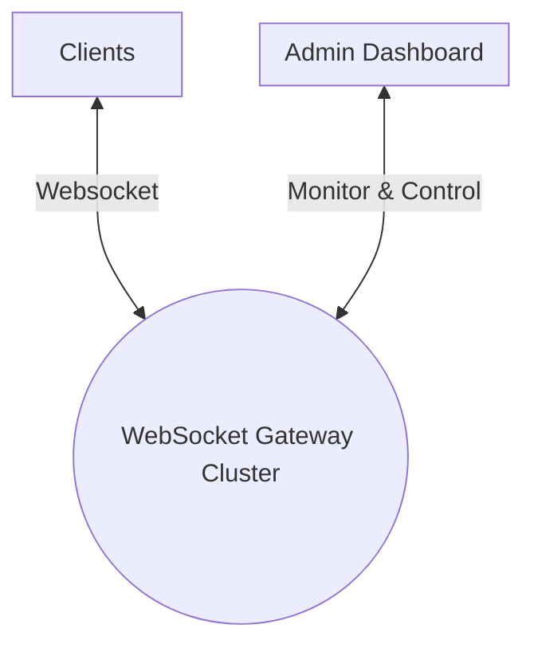

### 3.2 Objectives & Success Criteria

| Metric | Target |
|--------|--------|
| Concurrent Connections | >= 100,000 |
| Latency (P95) | \<= 100ms |
| Throughput | >= 50,000 msg/s per gateway node |
| Availability | 99.99% uptime |
| Scalability | Horizontal scaling with zero downtime, shared domain across multiple clusters |
| Monitoring | All critical metrics (connections, latency, errors) monitored and alerted |
| Compliance | Pass security and compliance audits (GDPR, PCI DSS) |

---

## 4. Architectural Design

### 4.1 Technology Stack

| Layer | Technology | Purpose |
|-------|-----------|---------|
| **Frontend (Client-Facing)** | HAProxy | TCP/HTTP load balancing, connection distribution, health checks |
| **Core WebSocket Cluster** | Rust (tokio, tungstenite, axum) | High-performance async runtime for WebSocket servers |
| | async-rate-limiter | Rate limiting for abuse prevention |
| **Dynamic Config Storage** | Redis | Dynamic config, detect peer join/left, negotiation communication |
| **Replication / Fanout** | NATS | Cross-region replication, replay capability |
| **Admin & Management** | Next.js (UI) | Web-based admin dashboard |

### 4.2 Architecture Overview

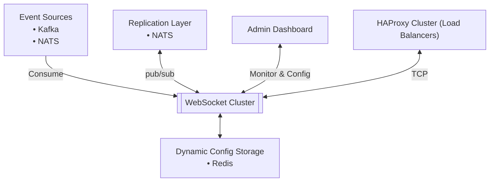

#### HAProxy Cluster (Load Balancers)

- **TCP load balancing** across the WebSocket server cluster
- Distributes client connections evenly across available nodes
- **Health checks** and **automatic failover** if a WebSocket node goes down

#### WebSocket Cluster

The heart of the system — handles client WebSocket connections, subscription management, and event delivery:

1. **Consume** from upstream event sources (Kafka, NATS)
2. **Publish/subscribe** internally via NATS replication layer for node sync
3. **Route events** to correct connected clients based on subscription rules
4. **Apply mapping logic** (format transformation, filtering)
5. **Scale horizontally** — each node is stateless with respect to client routing

#### Admin Dashboard

- Monitor connection counts, per-stream latency, event throughput
- Configure routing/mapping rules dynamically
- Control replication and scaling

### 4.3 Subsystems & Components

- Name
- Responsibility
- Interfaces
- Dependencies

### 4.4 Data Design

#### Summary Table: Data Flow Elements

| Component | Description |
|-----------|-------------|
| [**Connection**](#connection-flow-diagram) | WebSocket setup with endpoint (with listenKey if connecting to User data stream) |
| [**Ping–Pong**](#ping-pong-flow-diagram) | Keep-alive frames: client sends ping to server every 10s |
| [**Subscription**](#subscription-flow-diagram) | JSON subscribe/unsubscribe/list commands for streams |
| [**Market Data Streams**](#market-data-stream-flow-diagram) | Trade, kline, ticker, depth, liquidation, mark price, etc. |
| [**User Data**](#user-data-private-stream-flow-diagram) | Separate connection for account/order/position updates via listen key |

#### Connection Flow Diagram

**Standard Connection:**

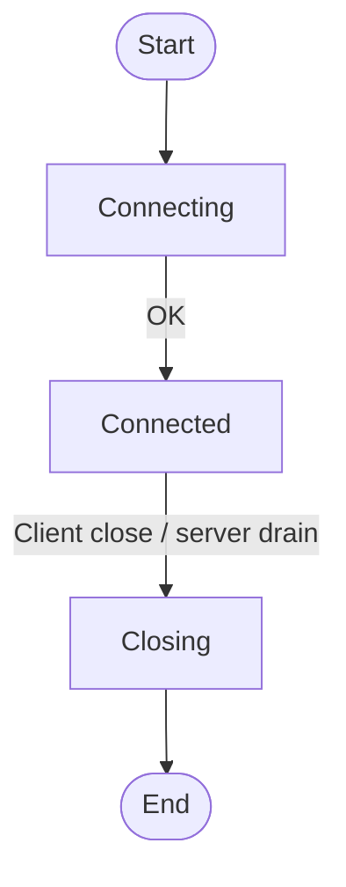

**Connection with listenKey:**

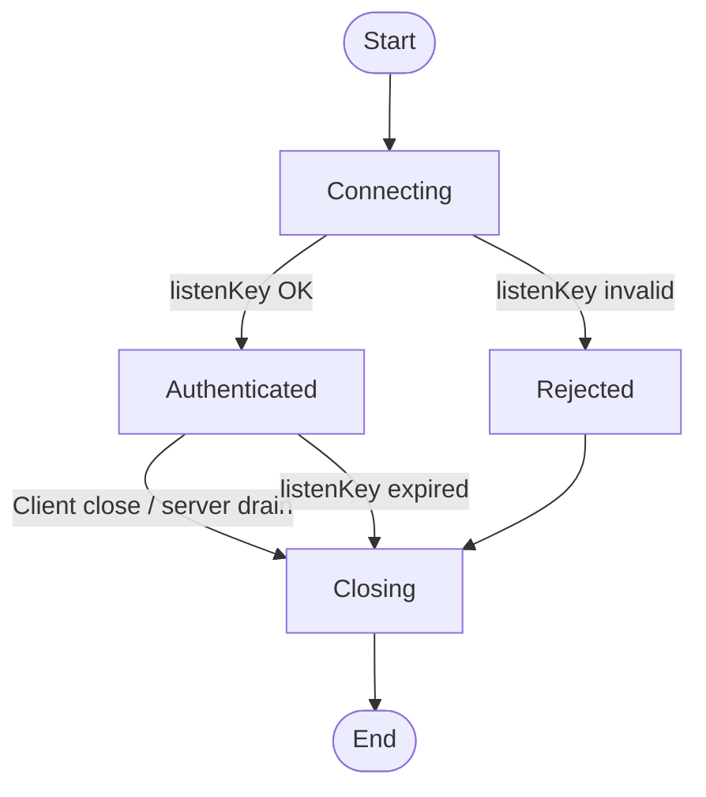

#### Ping-Pong Flow Diagram

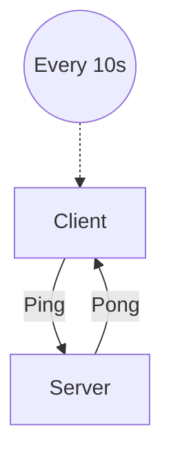

#### Market Data Stream Flow Diagram

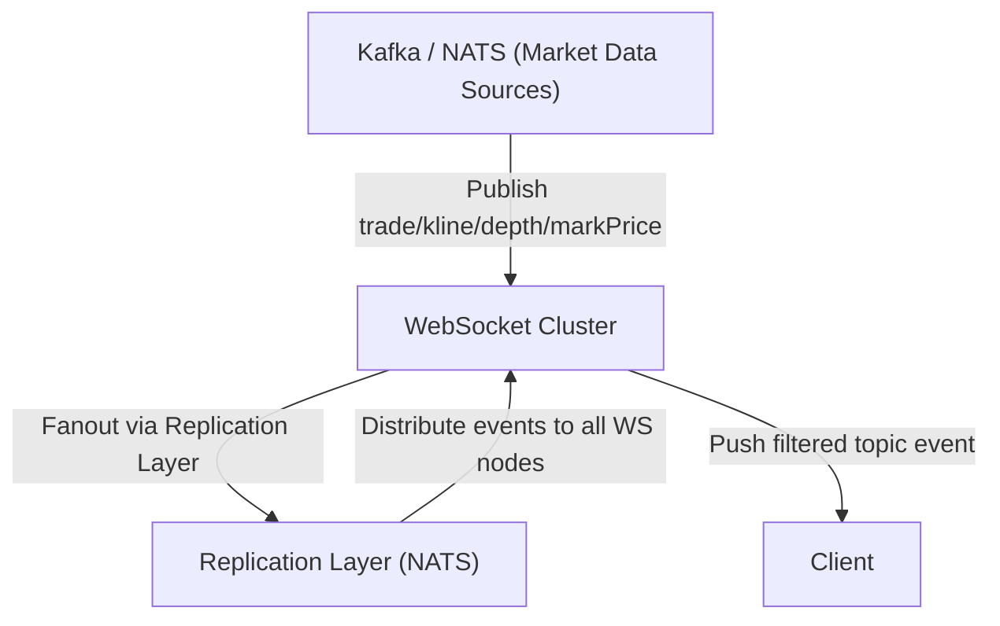

#### Apply Route & Mapping Rule

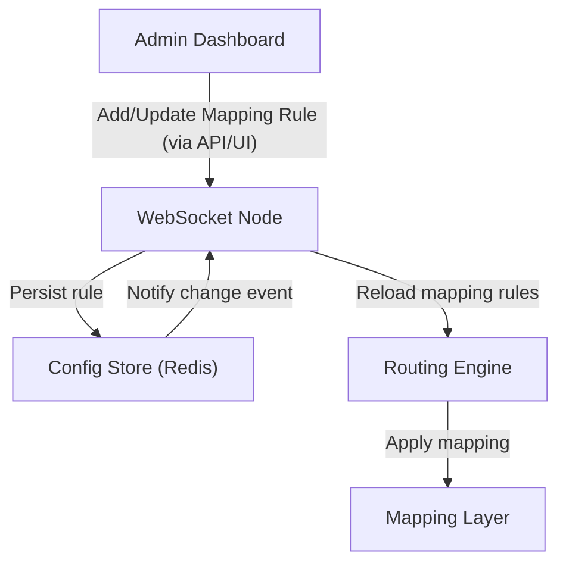

#### Subscription Flow Diagram

*To be documented.*

#### User Data Private Stream Flow Diagram

*To be documented.*

#### Config Update Event Handling

When a WS Node consumes a `config_update` event from the Config Store, it hot-reloads only the affected components (data sources, topics, routes, mappings) without interrupting live traffic.

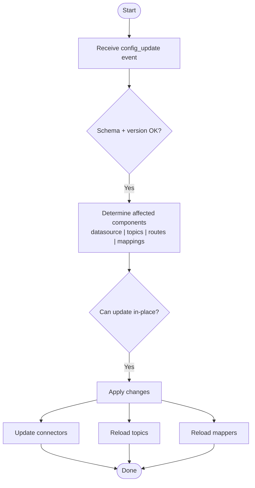

---

## 5. Detailed Design

### 5.1 UML: WebSocket Node Internal Structure

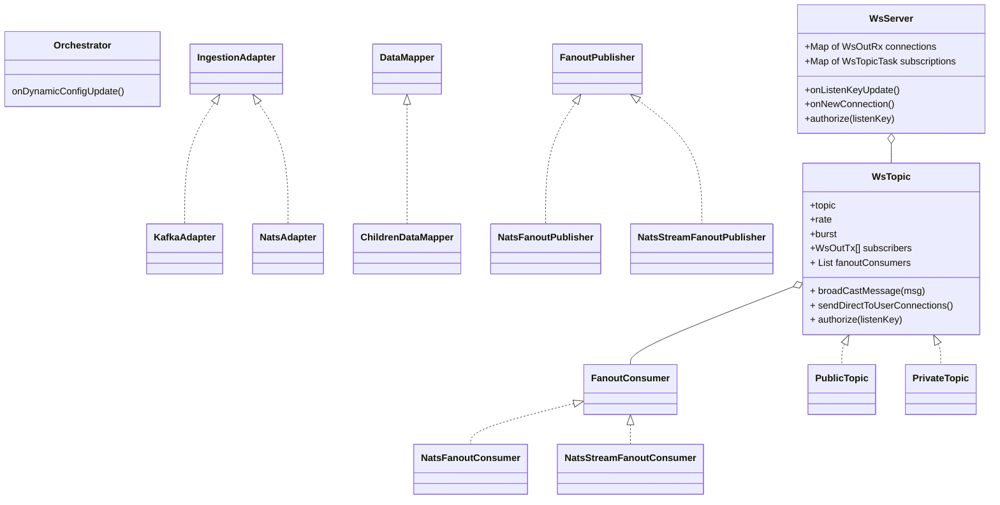

### 5.2 Routing & Mapping

<details>
    <summary><strong>Sample routing and mapping configuration</strong></summary>

    ```json
    {
        "datasource": [
    {
        "version": 1,
        "type": "kafka",
        "name": "default_kafka",
        "properties": {
        "bootstrap.servers": "kafka:9092",
        "group.id": "websocket_gateway_group",
        "auto.offset.reset": "earliest"
    }
    },
    {
        "version": 1,
        "type": "nats",
        "name": "default_nats",
        "properties": {
        "servers": ["nats://nats:4222"],
        "max_reconnect_attempts": 10,
        "reconnect_time_wait": 2
    }
    }
        ],
        "topics": [
    {
        "version": 1,
        "topic": "btcusdt@trade",
        "rate": 20,
        "burst": 60,
        "auth": "public"
    },
    {
        "version": 1,
        "topic": "btcusdt@depth",
        "auth": "public"
    },
    {
        "version": 1,
        "topic": "balance",
        "rate": 20,
        "burst": 60,
        "auth": "private"
    }
        ],
        "routes": [
    {
        "id": "uuid4",
        "version": 1,
        "peer_id": "6b86b273ff34fce19d6b804eff5a3f5747ada4eaa22f1d49c01e52ddb7875b4b",
        "data_source": "default_kafka",
        "mappings": [
    {
        "mapper": "trade_v1",
        "fanout_topic": "fanout.trade.btcusdt",
        "ws_topic": "btcusdt@trade"
    },
    {
        "mapper": "depth_v2",
        "fanout_topic": "fanout.depth.btcusdt",
        "ws_topic": "btcusdt@depth"
    },
    {
        "mapper": "balance",
        "fanout_topic": "fanout.balance",
        "ws_topic": "balance"
    }
        ]
    }
        ]
    }
    ```

</details>

#### 5.2.1 Negotiation Algorithm

##### Update Single Config

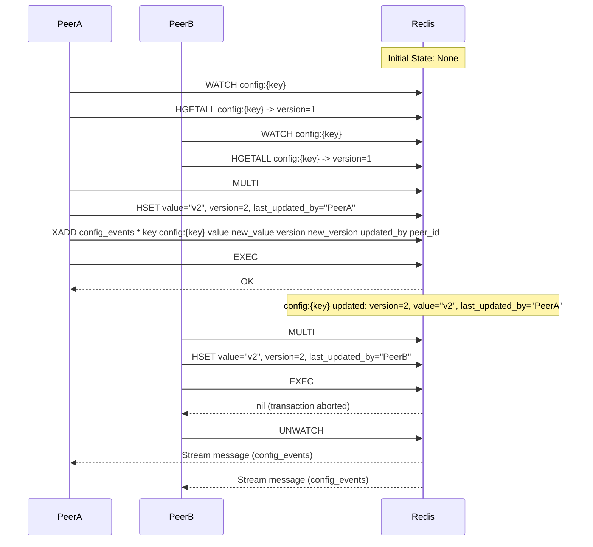

##### Config Event Processing

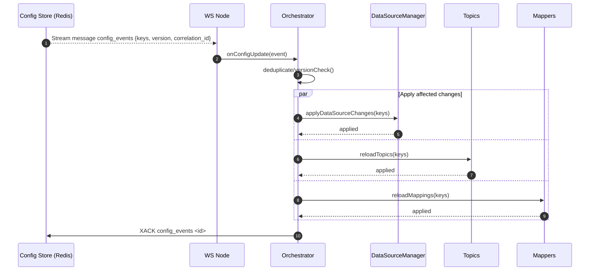

##### When a Peer Leaves — Rebalance Algorithm

1. PeerA detects PeerC left the cluster
2. PeerA acquires lock `peer-left:peer_id` on Redis:
- **Success**: publish `peer_left:peer_id` event to Redis stream `peer_update_queue`
- **Failure**: abort
3. PeerA or PeerB consumes `peer_update_queue` event → rebalance datasource → update routing config with [Update Single Config](#update-single-config) logic & remove `peer-left:peer_id`

##### When a Peer Joins — Rebalance Algorithm

1. PeerC comes online, publishes `peer_join:peer_id` event to Redis stream `peer_update_queue`
2. PeerA or PeerB consumes `peer_update_queue` event → rebalance datasource → update routing config with [Update Single Config](#update-single-config) logic

### 5.3 Listen Key

<details>
    <summary><strong>Sample listenKey structure</strong></summary>

    ```json
    {
        "userId": "12345",
        "iat": 1713543000,
        "exp": 1713546600,
        "scope": "user:stream"
    }
    ```

</details>

#### Create & Connect with listenKey

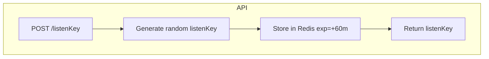

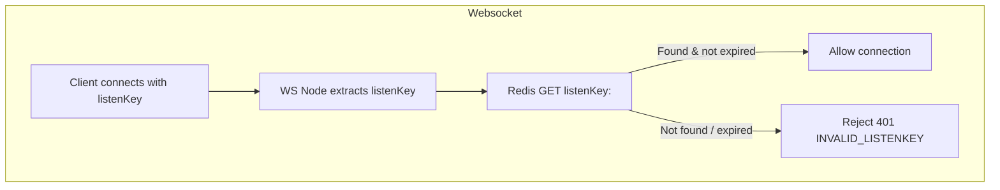

#### Revoke listenKey

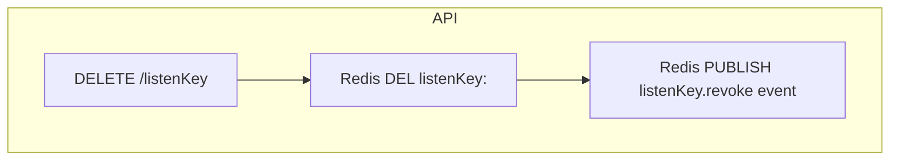

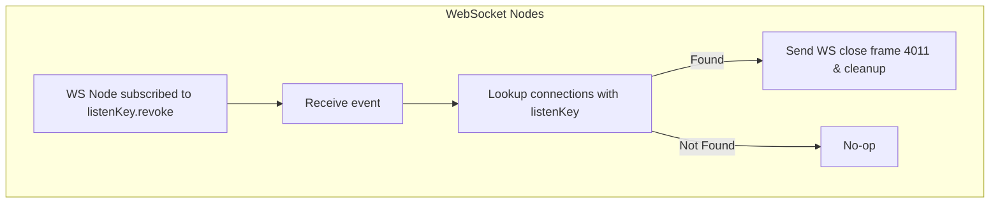

#### Reset Validity

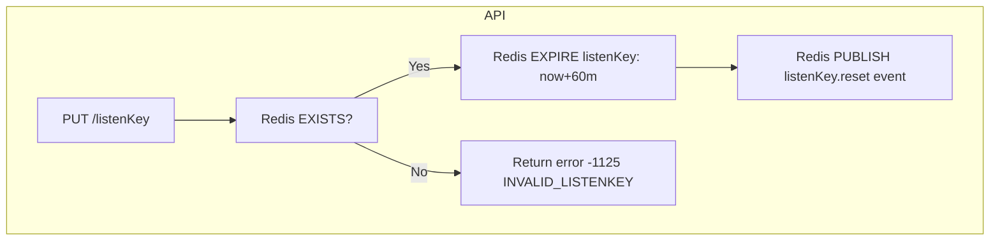

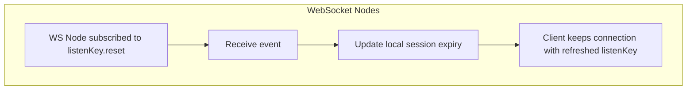

---

## 6. Integration & Interfaces

### Config Data Source

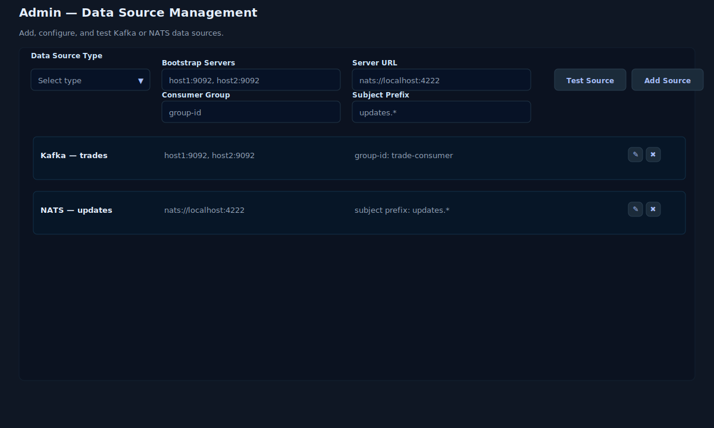

### Config WebSocket Topics

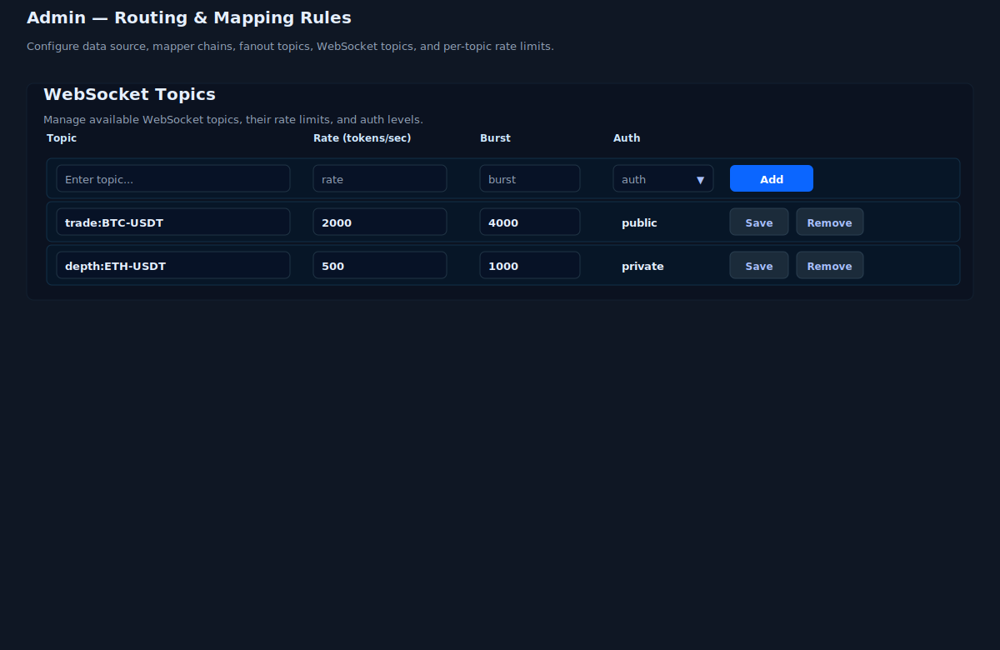

### Config Routing & Mapping per Data Source

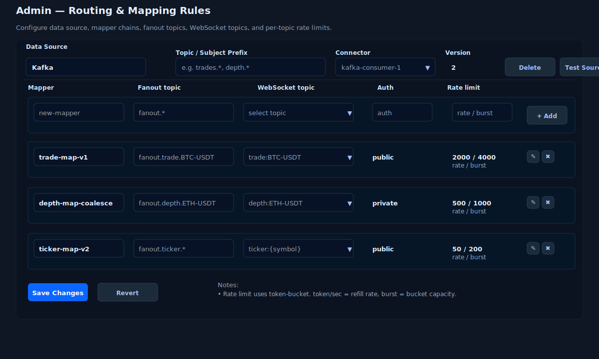

---

## 7. Security Design

*Updating...*

---

## 8. Performance & Scalability

See [3.2 Objectives & Success Criteria](#32-objectives--success-criteria).

---

## 9. Reliability & Availability

See [3.2 Objectives & Success Criteria](#32-objectives--success-criteria).

### 9.1 Rate Limiter

#### Rate Limit

- Defines the average speed at which tokens are added into the bucket
- Example: 100 tokens/sec → the system allows 100 actions per second on average

#### Burst (Bucket Capacity)

- Defines the maximum number of tokens the bucket can hold
- Allows short bursts of traffic above the average rate — as long as the bucket has accumulated tokens

:::tip Example
- **Rate** = 100 tokens/sec
- **Burst** = 200
- A client can send 200 messages instantly (if tokens were accumulated), then will be throttled to ~100/sec afterward
:::

#### Outbound Rate Limiting (server → client)

- Each connection has a send queue
- Apply per-connection limiter before pushing into queue
- If over limit → drop message or coalesce (e.g., compress order book deltas)

---

## 10. Deployment & Infrastructure

**Target deployment architecture:**

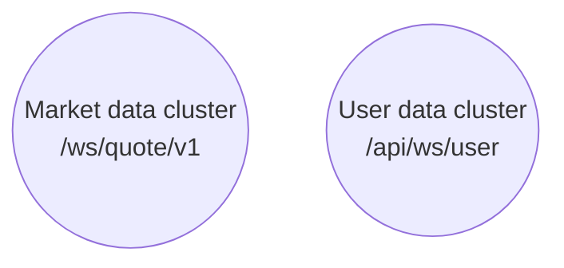

**Future migration:**

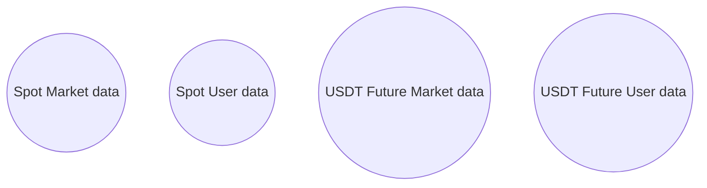

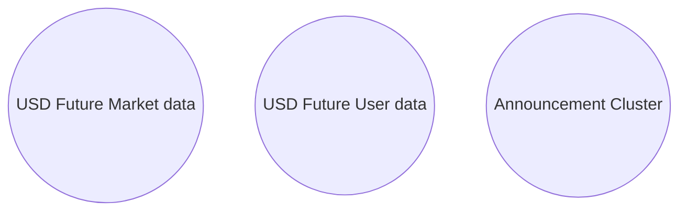

---

## 11. Non-Functional Requirements

*Updating...*

---

## 12. Risks & Mitigations

### 12.1 Infrastructure Risks

<details>
    <summary><strong>Redis Single Point of Failure (SPOF)</strong></summary>

    **Risk:** Redis is central for dynamic configuration, listenKey lifecycle, and peer coordination. Outage or
    partition leads to stalled config updates and failed authentication.

    **Mitigation:**
    - Deploy Redis in **cluster mode with sentinel/raft consensus** for automatic failover
    - Enable persistence (AOF) for recovery
    - Use Redis connection pooling and retry logic in clients

</details>

<details>
    <summary><strong>NATS Partitioning / Message Loss</strong></summary>

    **Risk:** Network partitions or broker node failure may cause missed replication messages or inconsistent state
    across WebSocket nodes.

    **Mitigation:**
    - Deploy NATS in **clustered mode with JetStream** (persistence + replay)
    - Enable **ack-based fanout** for critical messages
    - Monitor replication lag and set alerts

</details>

<details>
    <summary><strong>HAProxy Overload</strong></summary>

    **Risk:** Load balancers may become a bottleneck under sudden traffic spikes.

    **Mitigation:**
    - Use **multiple HAProxy instances** with DNS/GSLB distribution
    - Enable autoscaling on CPU/memory thresholds
    - Apply rate limiting/DDoS protection at the LB layer

</details>

---

### 12.2 Application-Level Risks

<details>
    <summary><strong>ListenKey Abuse</strong></summary>

    **Risk:** Attackers may generate or brute-force listenKeys, leading to unauthorized access.

    **Mitigation:**
    - Generate listenKeys using **cryptographically strong random values**
    - Enforce short TTL (e.g., 60m) with refresh required
    - Bind listenKeys to **userId + IP/device fingerprint**
    - Rate-limit API endpoints (`POST /listenKey`, `PUT /listenKey`)

</details>

<details>
    <summary><strong>Config Corruption / Version Skew</strong></summary>

    **Risk:** Incorrect or conflicting config updates can cause routing errors or dropped messages.

    **Mitigation:**
    - Apply **schema + version validation** before accepting updates
    - Use **transactional updates** with Redis WATCH/MULTI/EXEC
    - Maintain config audit logs for rollback

</details>

<details>
    <summary><strong>Unbounded Fanout / Backpressure</strong></summary>

    **Risk:** Sudden spikes in subscription counts or large depth updates can overload WS nodes.

    **Mitigation:**
    - Apply **per-topic and per-connection rate limits**
    - Use message **coalescing/delta compression** for order books
    - Drop non-critical updates under backpressure

</details>

---

### 12.3 Security Risks

<details>
    <summary><strong>Unauthorized Access</strong></summary>

    **Risk:** Clients may bypass authentication or hijack valid sessions.

    **Mitigation:**
    - Enforce **TLS everywhere**
    - Validate all requests with **API key / listenKey authentication**
    - Implement **WebSocket close codes** for unauthorized access attempts

</details>

<details>
    <summary><strong>DDoS Attacks</strong></summary>

    **Risk:** Massive connection floods or malformed payloads overwhelm servers.

    **Mitigation:**
    - Apply **connection rate limiting** at HAProxy + WebSocket layer
    - Implement **per-IP throttling + IP reputation blocking**
    - Deploy **WAF/CDN (e.g., Cloudflare)** for edge mitigation

</details>

---

## 13. Appendix

*Updating...*