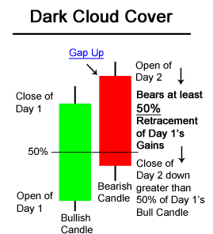
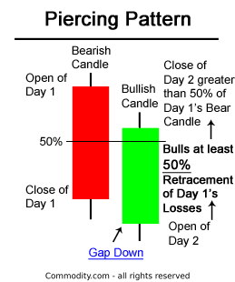
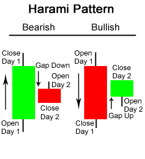
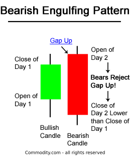
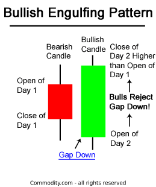
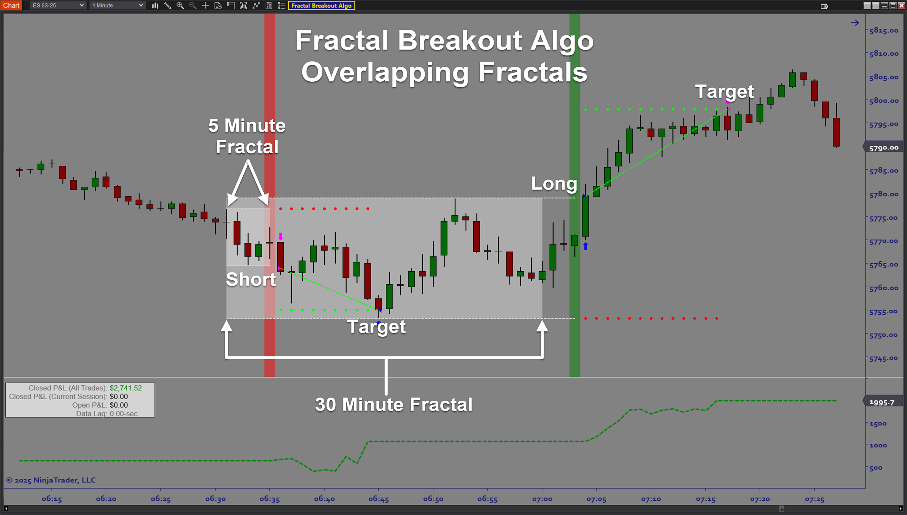
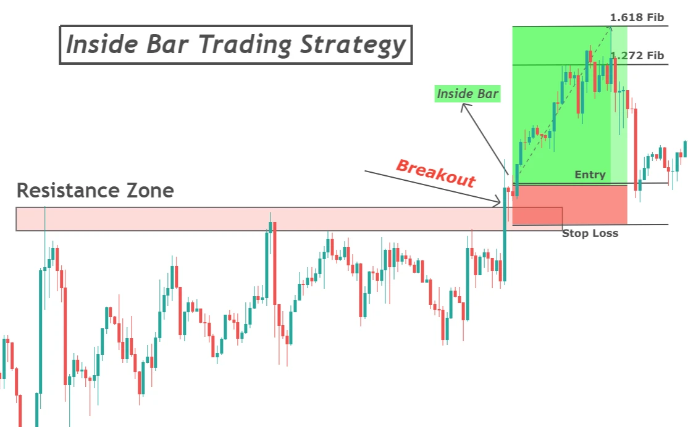
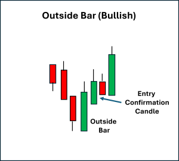
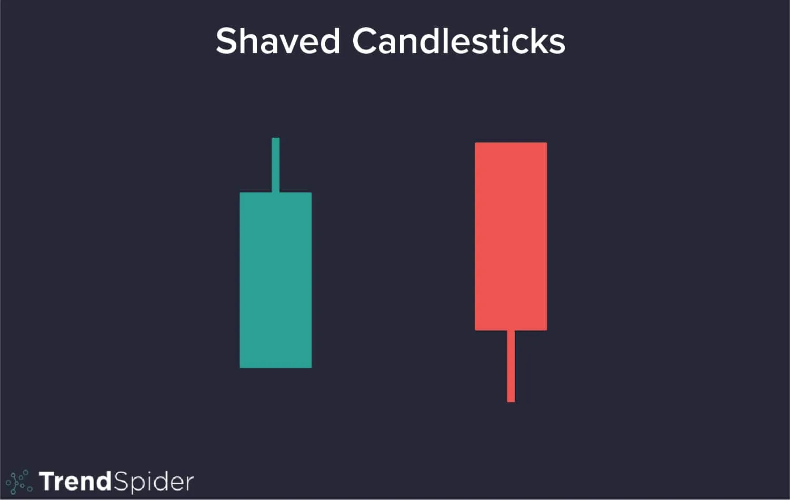
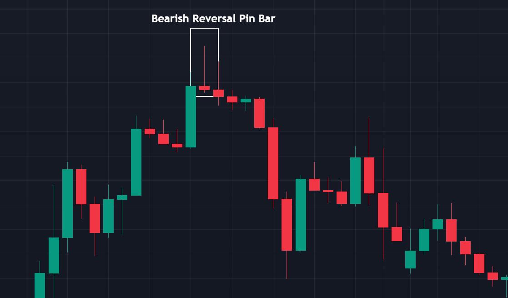

# WHAT HAPPENING ON THE F*CKING CHART

###### OHLCV candlestick

OHLCV data explained

- Open: The price at the beginning of the time interval.
- High: The highest price reached during the interval.
- Low: The lowest price reached during the interval.
- Close: The final price at the end of the interval.
- Volume: The total number of units (like shares or contracts) traded during the interval.

###### Pin Bar

A Pin Bar (short for “Pinocchio Bar”) is a single candlestick that shows a sharp rejection of price at one end of the
candle’s range — it has:

- a small real body (the open-close zone),
- a long tail (wick or shadow) in one direction,
- and a short or nonexistent opposite wick.

The long wick shows that the market tested a price level but then reversed strongly before the candle closed.

🔼 Bullish Pin Bar (Buyers’ Rejection)

🔻 Bearish Pin Bar (Sellers’ Rejection)

###### Dark Cloud Cover - Bearish reversal pattern

The pattern indicates a failure of the buyers to maintain control. Although the second session opened with a bullish
gap, sellers took over during the day and managed to push the price significantly lower, eroding the gains of the
previous day and closing below its midpoint. This shift suggests that sentiment is turning bearish, and a price reversal
may be imminent.

Traders often look for confirmation of the reversal in the subsequent trading session, such as a third bearish candle or
a breakout of key support levels, before entering a short position.

###### Piercing Line - Bullish reversal pattern

Trading considerations

- Confirmation: This pattern is more reliable when it occurs after a clear downtrend and is confirmed by other factors
  like increased volume on the second candle.
- Entry: A potential entry point can be above the high of the first candle.
- Stop-Loss: A stop-loss can be placed below the low of the first (bearish) candle.
- Invalidation: The pattern is not valid if the second candle fails to close above the midpoint of the first, or if
  there was no preceding downtrend in the first place.

###### Harami Pattern

Harami Candlestick Buy Signal

- A buy signal could be triggered when the day after the bullish Harami occured, price rose higher, closing above the
  downward resistance trendline. A bullish Harami pattern and a trendline break is a potent combination resulting in a
  strong buy signal.

- The second Harami pattern shown above on the chart of the E-mini Nasdaq 100 Future is a bearish reversal Harami. The
  first candle was a long bullish green candle. On the second candle, the market gapped down at the open. The chart
  above of the e-mini shows that Day 2 was a bearish candlestick; this made the bearish Harami even more bearish.

Harami Candlestick Sell Signal

- A sell signal could be triggered when the day after the bearish Harami occured, price fell even further down, closing
  below the upward support trendline. When combined, a bearish Harami pattern and a trendline break is a strong
  indication to sell.

- A somewhat opposite two candlestick reversal pattern is the Bearish Engulfing Pattern

#### Engulfing Pattern

Three methodologies for selling using the Bearish Engulfing Pattern are listed below in order of most aggressive to most
conservative:

- A trader might sell at the close of Day 2. If there is a substantial increase in volume that accompanies the large
  move downward in price (see: Volume), a trader might view this as an even stronger indication to sell.
- Also, a trader might sell on the day after the Bearish Engulfing Pattern occurs; by waiting until the next day to
  sell, a trader is trying to verify that the bearish reversal pattern is for real and was not just a one day occurance.
  In the chart above of Verizon, a trader would probably entered on the day after the Bearish Engulfing Pattern because
  the selling continued.
- Usually trader’s wait for other signals, such as a price break below the upward support line (see: Support &
  Resistance), before entering a sell order. However, in the case of Verizon above, the Bearish Engulfing Pattern
  occured at the same time as the trendline break below support.

There are three main times when a trader might buy using the Bullish Engulfing Pattern; the buy signals that are
presented below are ordered from the most aggressive to most conservative:

- A trader might buy at the close of Day 2 when prices rallied upwards from the gap down in the morning. Traders could
  interpret that the rally on Day 2 was significant and truly a reversal of market sentiment, if there was a substantial
  increase in volume that accompanied the large move upward in price

- Secondly a trader might buy on the day after the Bullish Engulfing Pattern occurs; by waiting until the next day to
  buy, a trader is attempting to confirm that the bullish reversal and enthusiasm of the prior day is continuing and was
  not just a one day occurance like a short covering rally. In the chart above of the SPY’s, a trader might not enter
  the market long on the day after the Bullish Engulfing Pattern because the market gapped down significantly and even
  made new lows. A trader using methodology #2, would likely wait for a different potential buy signal such as the one
  presented in method #3 next.

- Thirdly, a trader might wait after the bullish engulfing pattern for another signal, mainly a price break above the
  downward resistance line (see: Support & Resistance), before entering a buy order.

#### Bullish + Bearish Fractal S/R Break

The strategy focuses on a confirmed price break of these identified fractal levels, often indicating that the previous
trend or consolidation phase has ended and a new directional movement is likely starting.
This is when price breaks through a previously established fractal support or resistance level.

Bullish Fractal S/R Break:

- Price breaks above a previous bearish fractal (resistance).
- Indicates that the market has overcome a prior local high → bullish breakout signal.

Bearish Fractal S/R Break:

- Price breaks below a previous bullish fractal (support).
- Indicates that the market has broken a prior local low → bearish breakdown signal.

#### Inside Bar Pattern

Breakout Signal

When price breaks above or below the inside bar’s range, it signals that the period of consolidation has ended —
momentum is returning.

- Bullish breakout: price breaks above the mother bar’s high → buyers in control.
- Bearish breakout: price breaks below the mother bar’s low → sellers in control.
  This breakout can lead to continuation of the prior trend or a reversal, depending on context.

Continuation Signal

Inside bars often occur during strong trends — the market pauses before continuing in the same direction.

- In an uptrend, an inside bar breakout upward confirms continuation.
- In a downtrend, an inside bar breakout downward confirms continuation.

#### Outside Bar Pattern

Breakout Signal

Price has expanded beyond the previous candle’s range — this often signals a momentum breakout.

- Bullish breakout: confirms when price closes strongly above the previous high.
- Bearish breakout: confirms when price closes strongly below the previous low.

Continuation Signal

When this pattern appears in the direction of the existing trend, it often confirms trend continuation — the dominant
side has reaffirmed control.

#### Shaved Bar Pattern

Momentum Confirmation

- When appearing after a breakout or continuation, a shaved bar confirms strong momentum in that direction.

Reversal Confirmation

- After an exhaustion move, a shaved bar in the opposite direction can confirm a reversal if volume supports it.

Trend Strength

- Multiple consecutive shaved bars indicate trend acceleration — market moving with conviction.

#### Reversal Bar Pattern

Pin Bars reflect market psychology:

- The long wick shows where one side (buyers/sellers) tried to push price.
- The close shows that the opposite side took control and reversed that move.

They often appear at:

- Support/resistance zones
- Trendline touches
- Fibonacci levels
- Supply/demand areas

#### Moving Average

| **Type**   | **Full Name**                | **Description / Key Trait**                                           |
|------------|------------------------------|-----------------------------------------------------------------------|
| **SMA**    | *Simple Moving Average*      | Average of prices over a set period — smooth, but slow to react.      |
| **EMA**    | *Exponential Moving Average* | Gives more weight to recent prices — reacts faster than SMA.          |
| **WMA**    | *Weighted Moving Average*    | Linear weighting (most recent gets highest weight).                   |
| **VWMA**   | *Volume-Weighted MA*         | Weights prices by trading volume — shows where volume confirms trend. |
| **SMMA**   | *Smoothed Moving Average*    | Similar to EMA but smoother — filters more noise.                     |
| **DEMA**   | *Double Exponential MA*      | Reduces lag by combining EMA and its own EMA — faster signal.         |
| **TEMA**   | *Triple Exponential MA*      | Even less lag than DEMA — reacts very quickly to price changes.       |
| **HullMA** | *Hull Moving Average*        | Uses WMA with weighted smoothing — extremely smooth and responsive.   |
| **ZEMA**   | *Zero-Lag Exponential MA*    | Modified EMA designed to minimize lag while keeping smoothness.       |
| **TMA**    | *Triangular Moving Average*  | Double-smoothed SMA — very smooth but slowest to react.               |

- SMA/EMA/WMA: core basics (different speed/weighting).
- SMMA/TMA: smoother, lag more.
- DEMA/TEMA/ZEMA/HullMA: advanced versions — aim to reduce lag while staying smooth.
- VWMA: adds volume awareness to the average.